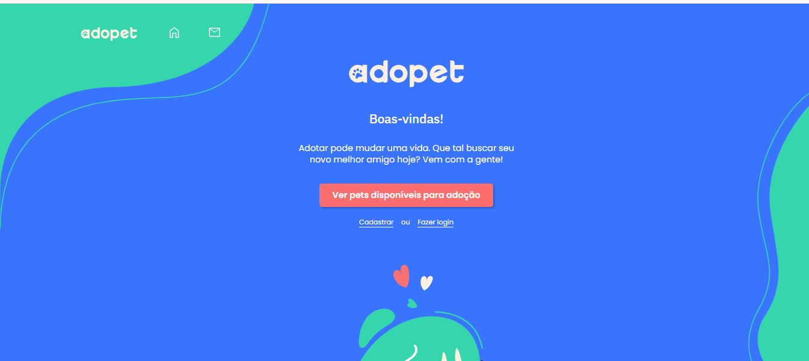

## Testando aplicação Adopet utilizando Selenium WebDriver com Java

Neste projeto me desafio a escrever testes com o Selenium para testar a aplicação disponibilizada pela Alura de nome AdoPet.

**Os cenários de teste desenvolvidos para testar o FrontEnd da aplicação foram:** Cadastro Correto, Cadastro incorreto, Verificar se as imagens dos pets aparecem na home sem logar, Verificar se as imagens dos pets aparecem na home do usuário logado, Verificar se o título da Página Inicial é Adopet, Verificar se alguns textos estão presentes na Página Inicial, Verificar Login de Forma Correta, Verificar se mensagens de erro aparecem se o login for feito de forma Incorreta, Verificar Fluxo de Login alternativo, Verificar se mensagens são enviadas corretamente, Verificar se mensagens de erro são mostradas com preenchimento Incorreto de uma mensagem, Verificar se na página de Perfil do Usuário aparece seu nome no campo de dados.

### Rodar o projeto

**Requerimentos:** 
Java JDK versão 21 LTS (Pode ser obtido em: https://www.oracle.com/java/technologies/downloads/) 
Editor Intelij Idea Community ou outro de sua preferência para Java. (Intelij Idea pode ser obtido em: https://www.jetbrains.com/idea/download/?section=windows) 
Git instalado na máquina. (Pode ser obtido em: https://git-scm.com/downloads)

**Passo a passo:**

Passo 1: com um terminal aberto, navegue até a pasta de sua preferência e digite `git clone https://github.com/VitorZary/Testando-aplicacao-adopet-com-selenium.git` para baixar o projeto.

Passo 2: Abra a pasta com a sua IDE favorita.

Passo 3: Baixe as dependências do projeto com o Maven, usando o Intelij vá no menu direito > Maven > Símbolo de atualizar > Reload All Maven Projects

Passo 4: Para executar todos os testes no Intelij navegue pela estrutura de pasta scr > test e clicando com o botão direito na pasta java selecione a opção "Run 'Tests in Java'"
